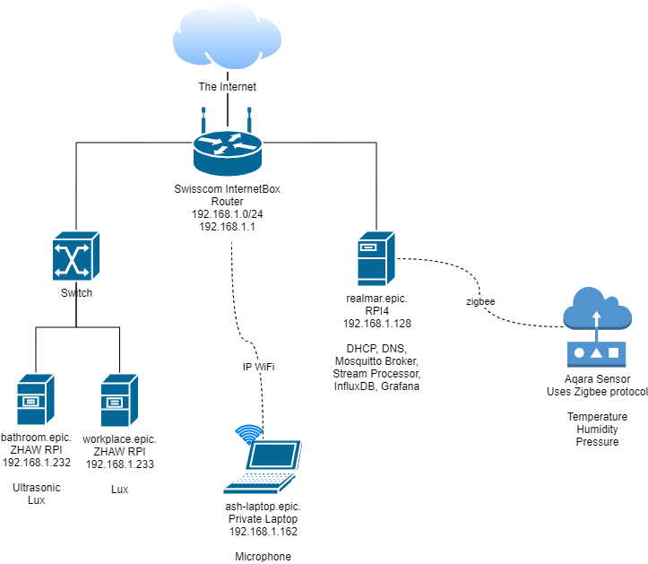
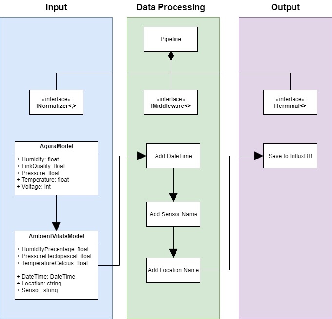
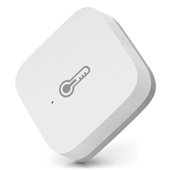
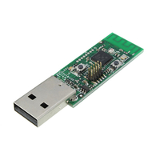

# IoT1 Project

Anastassios Martakos
ZHAW HS2020

## Introduction

Since I'm almost 24h in my apartment (42m2, 1 room --> main, storage, bathroom)
I want to collect information about my behavior. I setup various sensors in my
apartment to achieve this. All sensors send their data to a MQTT server, a
stream processor is subscribed to the relevant topics, processes the data and
stores it in an influxdb. Chronograf is used to visualize that data.

## Network

This section describe the general network configuration. I'm running my own
recursive DNS and DHCP server which are used to manage all the devices connected
the the network. The gateway is a swisscom box with most of its features (DNS,
DHCP, file server, etc.) disabled.

```
Domain                  epic
Network                 192.168.1.0/24
Gateway                 192.168.1.1
DHCP Range              192.168.1.130 - 192.168.1.252
DNS Server              192.168.1.128
```

## Infrastructure

We differentiate between devices belonging to the ZHAW and my personal devices.
Most sensors are running on ZHAW devices while stream processing, storage and
visualization is done on my personal devices.

The reason for this being is that, I already have a minimal setup running and
thus I thought I would use it for this project.



**New infrastructure:**

Those devices are all taken from the ZHAW and have 1 or more sensors attached to
them. Furthermore, they run a python script which publishes the sensor data to
the MQTT server.

|        MAC        |      IP       |         FQDN         |      Purpose      |
| :---------------- | :------------ | :------------------- | :---------------- |
| B8:27:EB:E2:F0:4D | 192.168.1.232 | iot1-bathroom.epic.  | ultrasound, light |
| B8:27:EB:23:75:13 | 192.168.1.233 | iot1-workplace.epic. | light             |

**Existing infrastructure:**

Those are my personal devices.

The main device is my RPI4 which connects to the temp/humidity/press sensor and
also runs the stream processing, influxdb and chronograf.

|        MAC        |      IP       |       FQDN       |  Purpose   |
| :---------------- | :------------ | :--------------- | :--------- |
| B8:27:EB:E2:F0:4D | 192.168.1.128 | realmar.epic.    | controller |
| AC:ED:5C:23:AA:C3 | 192.168.1.162 | ash-laptop.epic. | microphone |

## Deployment

The deployment is fully automated using [Ansible](https://www.ansible.com/). It
is open source and can be found on
[GitHub](https://github.com/realmar/pihole-ansible). Please note that the name
`pihole` is misleading, I have plans to change it to
`personal-infrastructure-ansible`. Initially, I only wanted to run
[pihole](https://pi-hole.net/) but the thing grew over time but I never changed
the name.

 - [zhaw_inventory_dev_iot1.ini](https://github.com/realmar/pihole-ansible/blob/master/zhaw_inventory_dev_iot1.ini)
 - [zhaw_01_iot1_base.yml](https://github.com/realmar/pihole-ansible/blob/master/zhaw_01_iot1_base.yml) base system provisioning
 - [zhaw_02_iot1_services.yml](https://github.com/realmar/pihole-ansible/blob/master/zhaw_02_iot1_services.yml) provisioning on services: sensors (python scripts) and controller (stream processing etc.)
 - [roles/zhaw/iot1](https://github.com/realmar/pihole-ansible/tree/master/roles/discord) folder contains all roles specific to this project
 - [Vagrantfile](https://github.com/realmar/pihole-ansible/blob/master/Vagrantfile): provision VMs for development using [vagrant](https://www.vagrantup.com/)

The ZHAW sensors are pre-provisioned with a ZHAW image which already contains
all the required python packages to work with the GroovePI+ and the MQTT server.

## Software

**Sensors:**

 - [paho-mqtt](https://pypi.org/project/paho-mqtt/) is used to send the sensor data to the MQTT server
 - grove_pi_interface is used to interface with the GroovePI+

**Controller:**

Following applications are used:

 - [InfluxDB](https://www.influxdata.com/) persist the data
 - [Chronograf](https://www.influxdata.com/time-series-platform/chronograf/) visualize the data
 - [Docker](https://www.docker.com/) run influxdb, chronograf, stream processor, etc.

### Stream Processing Application

 - [GitHub Project](https://github.com/realmar/pihole-ansible/tree/master/roles/discord)

I wrote my own stream processing application. Following libraries are used:

 - [.NET](https://dotnet.microsoft.com/)
 - [MQTTTnet](https://github.com/chkr1011/MQTTnet)
 - [influxdb-client](https://github.com/influxdata/influxdb-client-csharp)

Architecture diagram:



## Configuration

I have a temperature, humidity and pressure sensor from Aqara. It is connected
using zigbee to my personal RPI4 (`realmar.epic.`).

 - Sensor: [temperature_humidity_sensor](https://www.aqara.com/us/temperature_humidity_sensor.html)



 - Zigbee adapter: [Texas Instruments CC2531](https://www.ti.com/product/CC2531)



 - You can find the instructions on how to setup this [here](https://www.zigbee2mqtt.io/getting_started/what_do_i_need.html)


I'm using [zigbee2mqtt](https://www.zigbee2mqtt.io/) to send the sensor data to
MQTT. Currently, this is the only only sensor connected to that adapter.

```sh
zigbee2mqtt/aqara-temperature-humidity-sensor-01

  # Example data
  {
    "battery": 100,
    "humidity": 50.35,
    "linkquality": 84,
    "pressure": 962.8,
    "temperature": 23.77,
    "voltage": 3005
  }
```

All topics starting with `iot1` contain data which comes from ZHAW sensors and
devices. They have following naming convention:
`iot1/<sensor>/<location>`

All those `iot1` topics publish a single value in following format:

```sh
{
  "value": 89.99
}
```

The reason being that the sensors I use only ever emit one value. So there is
not point in sending anything more.

 - [Light Sensor](https://wiki.seeedstudio.com/Grove-Light_Sensor/)

```sh
iot1/+/+

  # Here are some examples
  iot1/light/workplace
  iot1/light/bathroom
  iot1/light/kitchen
  # etc.
```

 - [Ultrasonic Ranger](https://wiki.seeedstudio.com/Grove-Ultrasonic_Ranger/)
 - [80cm Infrared Proximity Sensor](https://wiki.seeedstudio.com/Grove-80cm_Infrared_Proximity_Sensor/)

```sh
iot1/+/+

  # Here are some examples
  iot1/infrared/bathroom
  iot1/ultrasound/kitchen
  # etc.
```

Other topics used during development

```
mock/#

  mock/data/<location>
```

Depending on the type of sensor different MQTT QoS level are chosen:

**lux** and **zigbee2mqtt/** QoS: `0`

It does not matter if we miss some events or get some duplicate events. We
expect that the measurements don't change frequently, so we will get a lot of
similar data. Thus we want to average (down sample) the data over a time span
and so it does not matter if we miss some events or get duplicates.

**infrared** and **ultrasound** QoS: `2`

We use this sensor to track how many times a person walk by a point of interest.
Not receiving any data or receiving more data would falsify the results. Meaning
that it is important that we know the exact count that this event has happened.
Furthermore, we want to calculate how long the person stays at a point of
interests. (eg. what is the average duration of bathroom breaks) In order for
that to know we must not miss any event and also not receive too many events.

Enter --> is_at_location = true  
Leave --> is_at_location = false

## Results

